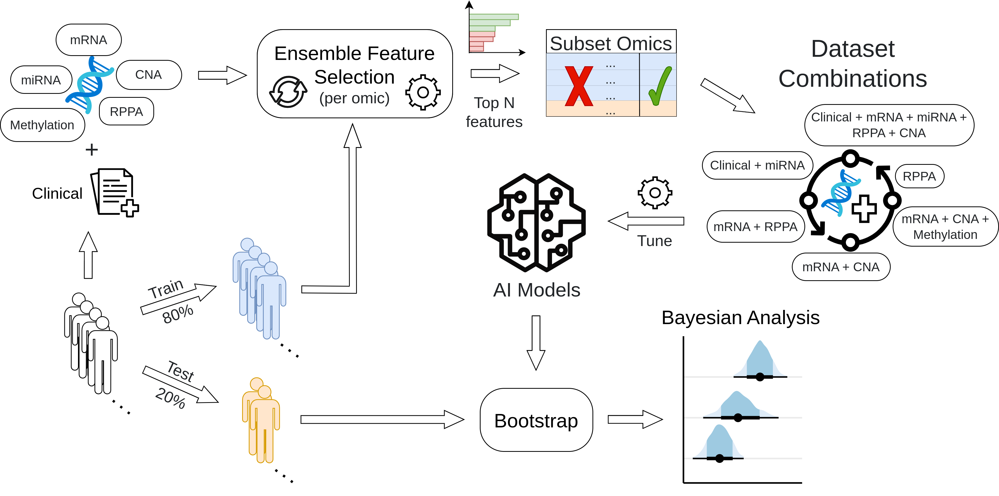

# tcga-survmob

## Intro

This repository is a continuation of [paad-survival-bench](https://github.com/bblodfon/paad-survival-bench), which included the initial code and several investigations conducted in TCGA's PAAD cohort.
In the present repository, we use the [survmob](https://github.com/bblodfon/survmob) R package along with many [mlr3](https://github.com/mlr-org) packages to benchmark several survival ML models across many TCGA multimodal datasets and analyze the output results using Bayesian methods.

## Benchmarking Workflow

Each step from the above workflow corresponds to a separate script.
These scripts can be accessed in the folders whose names match the abbreviated TCGA study names, e.g. `PAAD`, `BLCA`, `OV`, etc.

The **order of script execution** per cancer study is as follows:

- `download_data.R` => Download omics and clinical data download, initial patient and omic filtering
- `preprocess.R` => Convert datasets to `mlr3` survival tasks, preprocess omics data
- `data_split.R` => Split cohort to train and test sets
- `efs.R` => Perform ensemble feature selection (per omic dataset)
- `task_subset.R` => Subset `mlr3` tasks to the most stable/robust features
- `benchmark.R` => Perform the benchmark (AI model tuning and testing on all combinations of omics and clinical data)
- `bench_bayes.R` => Fit Bayesian Linear Mixed-Effects (LME) models using the benchmarking results
- `bench_bayes_vis.R` => Visualize model and omics rankings and other Bayesian posterior distribution differences
- `bench_boot_vis.R` => Visualization of bootstrapped results on the test set cohort

## Additional analyses

- `efs_analysis.R` => Visualize the ensemble feature selection results per omic
- `efs_multimodal.R` => Perform ensemble feature selection on a unified multi-modal dataset that combines all omics and the clinical data
- `benchmark_multimodal.R` => Perform the benchmark (AI model tuning and testing on the unified multimodal dataset after feature selection)
- `efs_inv/msr_comp.R` => Comparison of two metrics (RCLL vs C-index) for optimizing the ensemble feature selection algorithm

## Notes

- Open an issue if you want the full downloaded or processed datasets or any analysis result (R compressed objects) that due to size restrictions are not on this repository.
- `check_packages.R` => versions of most important packages used.
  - `survmob` version used: [v0.1.1](https://github.com/bblodfon/survmob/releases/tag/v0.1.1)
  - Main `R` library for download and filtering/processing of the TCGA multi-omics was [curatedTCGAData](https://github.com/waldronlab/curatedTCGAData).
